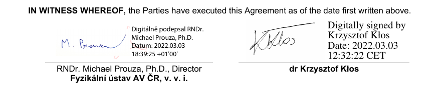
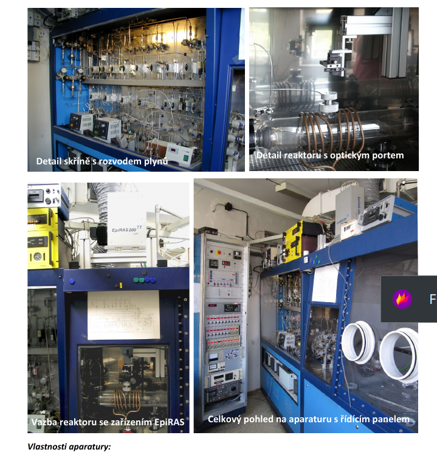

```{r setup, include=FALSE}
library(stringr)
library(ggplot2)
library(rmarkdown)
library(knitr)

#cover-img: ../img/E0_with_bubblers.jpeg

```


```{r fig-options, include=FALSE}
base_dir <- "~/photin/krzyklo.github.io/" # i.e. where the jekyll blog is on the hard drive.
base_url <- "/" # keep as is

# If the document is currently being knit, do this; skip it in normal execution
if (!is.null(knitr::current_input())){
  
  # Output path for figures
  fig_path <- paste0("_site/assets/img/", str_remove(knitr::current_input(), ".Rmd"), "/")
  
  # Set base directories
  knitr::opts_knit$set(base.dir = base_dir, base.url = base_url)
  
  # Set figure directories
  knitr::opts_chunk$set(fig.path = fig_path,
                      cache.path = '../cache/',
                      message=FALSE, warning=FALSE,
                      cache = FALSE)
}

```

Photin acquired the first commercial Aixtron Aix-200RF reactor, superbly rebuilt and maintained by Czech Academy of Sciences team.

```{r fig1, include=TRUE, echo=F, warning=F, message=F}
# All defaults

```


This purchase finalize phase of investments into MOCVD capabilities for Photin.   
With fleet of 3x Aix-200 reactors, complemented by planetary Aix 2400 G1, Photin offer customers perfect environment for R&D and small scale production.

```{r fig2, include=TRUE, echo=F, warning=F, message=F}
# All defaults

```
Acquired FZU reactor is equipped in state of the art in-situ Reflectance Anisotropy Spectroscopy (EpiRAS TT made by LayTec), the most powerful diagnostic technique available in MOCVD technology. It allows in situ  measurements of growth rate and surface smoothness, but is also sensitive to surface reconstruction of layer’s atomic planes.  
This is ultimate tool for in situ optimization of MOCVD gas switching sequences and could provide information about doping of layers in ~1e17-1e19cm-3 range.
Transfer of the reactor to Photin HQ is planned for end of May 2022.  

**Would like to thank FZU team: Alice, Jiri and Karel, who kept operational and upgraded this marvelous piece of technology for all this years.**  
This is prime example, that optoelectronics leap forward, but physics do not change. 
Also it is showcase how well Aixtron machines are made.  


**Inquiries for growth of 2” wafers on GaSb, GaAs, and InP could be sent to kk{sign}photin.eu.**
