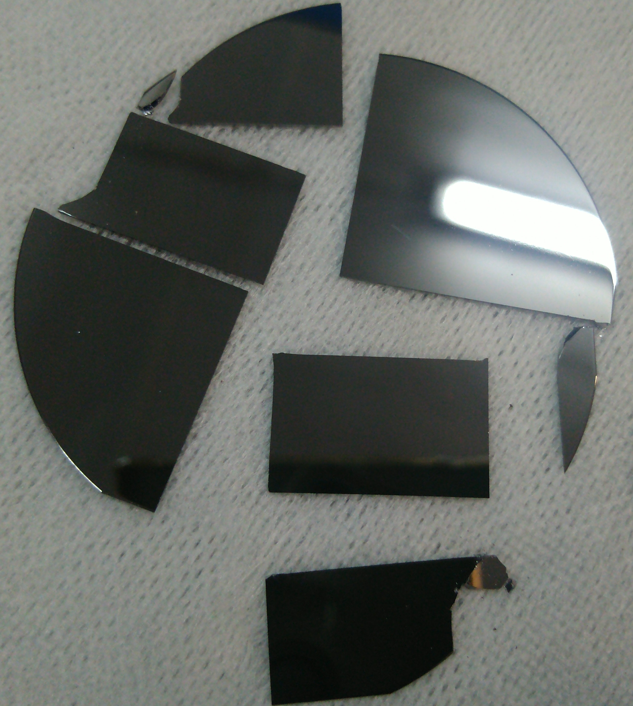
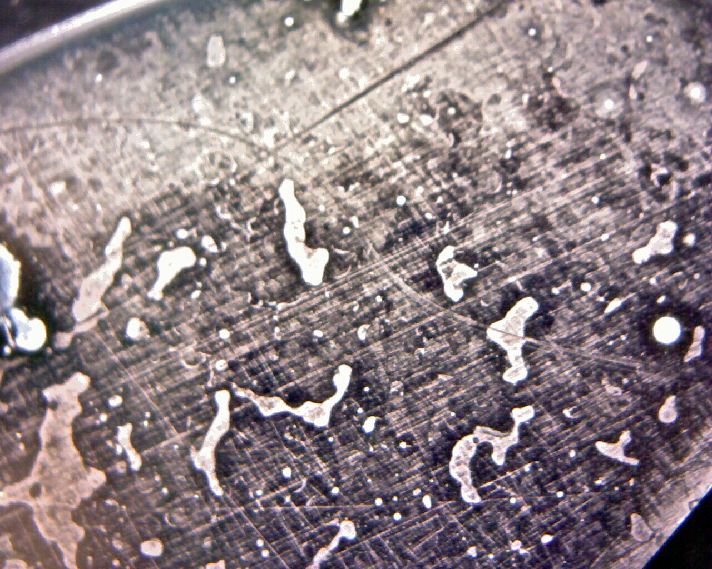

```{r setup, include=FALSE}
library(stringr)
library(ggplot2)
library(rmarkdown)
library(knitr)

#cover-img: ../img/E0_with_bubblers.jpeg

```

```{r fig-options, include=FALSE}
base_dir <- "~/photin/krzyklo.github.io/" # i.e. where the jekyll blog is on the hard drive.
base_url <- "/" # keep as is

# If the document is currently being knit, do this; skip it in normal execution
if (!is.null(knitr::current_input())){
  
  # Output path for figures
  fig_path <- paste0("_site/assets/img/220504-T2SLs-MOCVD/", str_remove(knitr::current_input(), ".Rmd"), "/")
  
  # Set base directories
  knitr::opts_knit$set(base.dir = base_dir, base.url = base_url)
  
  # Set figure directories
  knitr::opts_chunk$set(fig.path = fig_path,
                      cache.path = '../cache/',
                      message=FALSE, warning=FALSE,
                      cache = FALSE)
}

```


Well, finally have started first growths. It took a while, as there were some modifications and adaptations necessary to make GaN reactor become III-Sb reactor:    

1) additional dust filter before the main pump ^[Normally GaN reactors have just quartz siphon immediately after the reaction chamber, whereas GaAs/InP/GaSb have more in-line filters that protect the main pump from contamination. For long time, didn't know how to tackle this one, as standard filters used by Aixtron are bulky, water cooled, and there was no space for such filter in closely packed vacuum section under reactor. Finally, solution come from inspecting the FZU reactor, during checks before purchase. On this reactor there was smaller, not cooled Pall-type filter. After a few hours of searching for suitable and affordable vacuum filter, bought one, which should be perfect.],     
2) ultrasonic precursor monitors on Ga and Sb delivery lines, to be able to exactly see amount of reagents flowing into reactor. This is essential feature of reactors for III-Sb materials, where exact III/V ratio need to be kept for long hours of growth.^[Ultrasonic monitors are one of key hardware advancement, that were developed in latest ~15 years, and help to stabilize and control notorious drifts of metalorganic precursors delivery. It is deep topic worth, separate series of posts. Verification, start-up and validation of this devices took quite a while, despite significant experience with this units in the past.]  

3) conduct careful helium leak check of all gas and vacuum sections of reactor.   

After so many years of writing recipes for other reactors, now preparing to start own reactor. So many things could go wrong: flowcontrollers, cooling, pressure, communication between PC, valves, heaters, errors in recipe..  
<br>
This reactors have full visualization of reactor status on front of electronic cabinet, therefore you could see what is going on, or even take control, and manually flip switches, set pressures and flows, adjust the process.  
But all went fine..  Below it could be seen some process parameters..

<figure>
  
  <figcaption>Fig. 1. Front panel of reactor - growth of GaSb. </figcaption>
</figure>

This first runs are important to test equipment, check parameter space, and get proper III/V ratio, for GaSb buffers which quality are key for all next layers.  
Also it is important to study the costs of reactor operation - electricity, technical gases consumption, time it takes to start and cool down..  all will help to set prices.  
<BR>
How many runs it will take to optimize GaSb buffers on GaSb? Hopefully, just one 2" substrate broken to many pieces ;-).  

```{r fig0, include=TRUE, echo=F, warning=F, message=F, fig.cap="2'' GaSb cleaved into 6 pieces."}
# All defaults
#
```

<figure>
  
  <figcaption>Fig. 2. GaSb substrate cleaved into 6 pieces.</figcaption>
</figure>

BTW. The reactor 1181 started as GaAs reactor with quartz IR heaters, then it was upgraded for GaN with RF heating and reactor tube cooling, to let it reach ~1050C (normal GaAs reactors reach only ~850C).


```{r fig1, include=TRUE, echo=F, warning=F, message=F, fig.cap="Hey!, no one expected it to be perfect in first run! ;-)"}
# All defaults
#
```

<figure>
  
  <figcaption>Fig. 3. Hey!, Who would expect to get it perfect in first run! ;-) </figcaption>
</figure>

Lets see, how quick will be convergence to reasonable growth parameters.. will keep you posted.  


