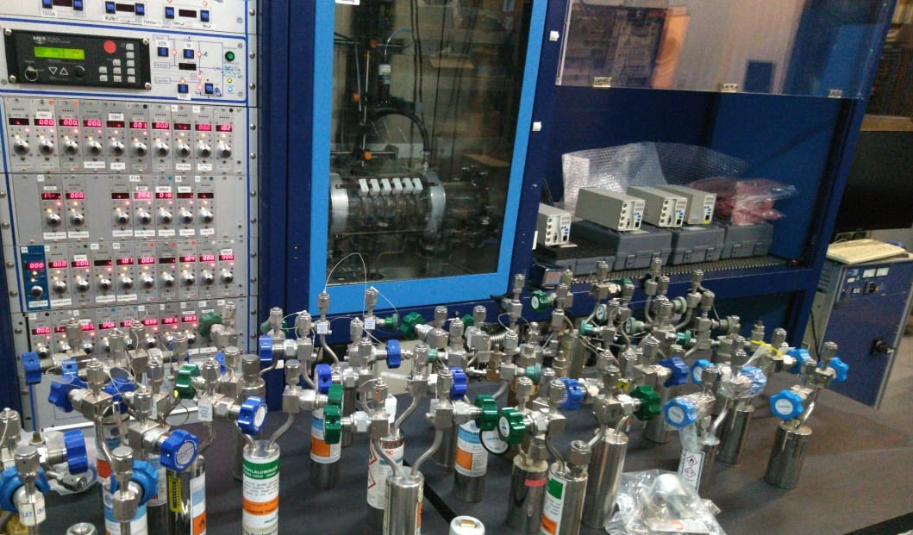

---
title: MOCVD T2SLs
author: "Jiri Pangrac, Krzysztof Kłos"
date: "04/05/2022"
output:
  pdf_document: default
  md_document:
    variant: gfm
    preserve_yaml: TRUE
knit: (function(inputFile, encoding) {
  rmarkdown::render(inputFile, 
  encoding = encoding, 
  output_file=paste0(Sys.Date(), "-", sub(".Rmd", ".pdf",inputFile)), 
  output_dir = "~/photin/krzyklo.github.io/_posts/") })
  
layout: post

cover-img: /assets/img/Aix200RF_heat_up_test.jpeg
thumbnail-img: /assets/img/E0_with_bubblers.jpeg
share-img: /assets/img/path.jpg
tags: [news, projects]
always_allow_html: true
---

T2SLs is relatively new concept in III-V semiconductors, which gained a lot of interest due to prospects of being able to offer III-V based IR detectors, which would replace HgCdTe for LWIR and MWIR range. 
Usually T2SLs are grown in MBE, since it is much easier to get good quality antimonides in MBE. Over the recent years there are as well some results, that demonstrate capability of MOCVD technology for growth of quality T2SLs epitaxial structures. 

Inspired by [Yong Huang et. al](https://doi.org/10.1063/1.5115269) we wanted to have quick stab at testing insight shared in this paper.  
The InAs/GaSb SLs strain balance strategy employed in MBE on GaSb substrate and MOCVD on InAs substrate differ.  


```{r setup, include=FALSE}
library(stringr)
library(ggplot2)
library(rmarkdown)
library(knitr)

#cover-img: ../img/E0_with_bubblers.jpeg

```


```{r fig-options, include=FALSE}
base_dir <- "~/photin/krzyklo.github.io/" # i.e. where the jekyll blog is on the hard drive.
base_url <- "/" # keep as is

# If the document is currently being knit, do this; skip it in normal execution
if (!is.null(knitr::current_input())){
  
  # Output path for figures
  fig_path <- paste0("_site/assets/img/220504-T2SLs-MOCVD/", str_remove(knitr::current_input(), ".Rmd"), "/")
  
  # Set base directories
  knitr::opts_knit$set(base.dir = base_dir, base.url = base_url)
  
  # Set figure directories
  knitr::opts_chunk$set(fig.path = fig_path,
                      cache.path = '../cache/',
                      message=FALSE, warning=FALSE,
                      cache = FALSE)
}

```


```{r fig1, include=TRUE, echo=F, warning=F, message=F}
# All defaults

```


This is 3rd reactor purchase for Photin. Acquisition of such well maintained, fully documented, and operational reactor resulted in synergy effects and rapid acceleration of works on Aixtron Aix-200/4 and Aixtron Aix 2400 G1 reactors standing in Photin facility.
All Photin reactors are based on VME technology known for ruggedness and reliability.

The Aix-200RF reactor was operational 1 week after transfer, and extensively tested on provisional water cooling and nitrogen supply. 
Facility works are in progress with outlook to grow first wafers in Q2 of 2022.  

**Inquiries for growth of 2” wafers on GaSb, GaAs, and InP could be sent to kk{sign}photin.eu.**

*Would like to acknowledge and express gratitude to prof. Ferdinand Scholz and his PhD students, who for decades worked on upgrades and maintenance of this reactor.*

