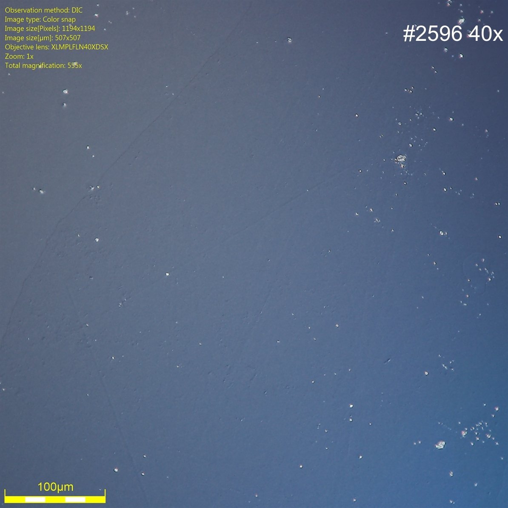

```{r setup, include=FALSE}
library(stringr)
library(ggplot2)
library(rmarkdown)
library(knitr)

library(cowplot)
library(magick)
library(here) # For making the script run without a wd
library(magrittr) # For piping the logo


#cover-img: ../img/E0_with_bubblers.jpeg

# All defaults
add_label=function(filename, path, label) {
  rawimg <- image_read(paste0(path, filename))
  outimg <- rawimg %>%
  #image_scale("100") %>% 
  #image_background("grey", flatten = TRUE) %>%
  #image_border("grey", "600x10") %>%
  image_annotate(label, color = "white", size = 50, 
                 location = "+10+50", gravity = "northeast")  
  image_write(outimg, 
              paste0(path, tools::file_path_sans_ext(filename), "-ann",".jpg") )
}


```

```{r fig-options, include=FALSE}
base_dir <- "~/photin/krzyklo.github.io/" # i.e. where the jekyll blog is on the hard drive.
base_url <- "/" # keep as is

# If the document is currently being knit, do this; skip it in normal execution
if (!is.null(knitr::current_input())){
  
  # Output path for figures
  fig_path <- paste0("_site/assets/img/220507-GaSb-optimization/", str_remove(knitr::current_input(), ".Rmd"), "/")
  
  # Set base directories
  knitr::opts_knit$set(base.dir = base_dir, base.url = base_url)
  
  # Set figure directories
  knitr::opts_chunk$set(fig.path = fig_path,
                      cache.path = '../cache/',
                      message=FALSE, warning=FALSE,
                      cache = FALSE)
}

```


Have started GaSb buffer development with cleaving Ensemble3 GaSb Zn-doped substrate (bought from EVO-R funds) to 6 pieces, and running experiments.  

In literature, not able to find info about the GaSb growth conditions with TMGa + TMSb, for Aix-200 type of reactor. There were a few excellent info, especially TEGa + TESb (which was also used by our partner FZU), and we used them as start point.   

For preliminary parameter scan for GaSb optimization, decided to not etch substrates, so would get larger roughness and characteristic "oxide defects patterns", but still the optimum V/III ratio should be clearly distinguishable.  

<figure>
  

</figure>


```{r fig-hillocks, include=TRUE, echo=F, warning=F, message=F, out.width="50%", fig.cap="Hey!, no one expected it to be perfect in first run! ;-)"}
# All defaults


```
\tiny Fig. 2. Nomarsky picture of surface with "the hillock" type of defects.


Around the run nr 4 the faith, that 1 substrate will be enough to optimize GaSb-on-GaSb buffers begin to tremble ;-), and we have split two the biggest pieces in half to get 8 pieces in total, and increase odds.  
Also first runs indicated that the TMGa Pressure Controller is not stable, and cause molar flow spikes.  

```{r fig-PC, include=TRUE, echo=F, warning=F, message=F, out.width="50%"}
# All defaults


```
Fig. 3 Construction of MFC/PC(left) and graph of log Sb/Ga ratio recorded by 2x ultrasonic precursor monitors.  

Photin have dozens of spare Pressure Controllers (PC), and 3rd replacement worked ok, not showing spikes in graphs of molar flow.
This kind of spikes (caused by too large opening of valve), could cause complete disaster especially, for ultrasonic monitors in closed-loop control mode with PID control (Episons). Our ultrasonic monitors do not have PID, so it would be less problems, but still it is better to have PC working without issues. This kind of problems with PC, are difficult to detect without ultrasonic monitors.  
<br>

Eventually, narrowed down the optimum GaSb buffer parameters with one substrate, in 8 runs, ~1 week.  
```{r fig0, include=TRUE, echo=F, warning=F, out.width="100%", message=F, fig.cap="2'' GaSb cleaved into 6 pieces."}
# All defaults

```
Fig. 3. Comparison of pictures taken by microscope  with Nomarsky contrast.  

As could be seen, in run nr #5 set proper Sb / Ga ratio, then explored going into a little Ga-rich buffers #7 and #8 to make sure, that optimal Sb /Ga ratio was found. Pictures shows that run nr #5 had best surface smoothness.   
**Key take away, is:**    

- **Te-rich GaSb give surface with hillocks patterns,**    

- **Ga-rich GaSb give streaky lines, that transition into Ga droplets on surface,**  

- **establishing proper Ga / Sb ratio for TMGa + TMSb in our reactor,**

- **ability to keep and reproduce exactly optimum Ga / Sb ratio with help of ultrasonic monitoring devices.** 

Comparing side by side buffers grown by FZU (TEGa + TESb, substrate HCl etched before loading) with buffers grown by Photin (TMGa + TMSb, not etched substrates).

```{r fig1, include=TRUE, echo=F, warning=F, message=F, out.width="50%"}
# All defaults
add_label("2596_10X_HDR_NR1.jpg", "../assets/img/220507-GaSb-optimization/", "#2596 10x") # add "-ann.jpg" at end of filename

add_label("05_10X_HDR_NR1.jpg", "../assets/img/220507-GaSb-optimization/", "#05 10x") # add "-ann.jpg" at end of filename

```

```{r fig-buff, include=TRUE, echo=F, warning=F, message=F, out.width="50%"}


raw0540 <- image_read("../assets/img/220507-GaSb-optimization/05_40X_HDR_NR1.jpg") 
raw2596_40 <- image_read("../assets/img/220507-GaSb-optimization/2596_40X_HDR.jpg")
# Scale down the logo and give it a border and annotation
# This is the cool part because you can do a lot to the image/logo before adding it
img05_40x <- raw0540 %>%
  #image_scale("100") %>% 
  #image_background("grey", flatten = TRUE) %>%
  #image_border("grey", "600x10") %>%
  image_annotate("#05 40x", color = "white", size = 50, 
                 location = "+10+50", gravity = "northeast")
img2596_40= raw2596_40 %>% 
  image_annotate("#2596 40x", color = "white", size = 50, 
                 location = "+10+50", gravity = "northeast")

# Stack them on top of each other
#final_plot <- image_append(image_scale(c(plot, logo), "500"), stack = TRUE)
# And overwrite the plot without a logo
#image_write(final_plot, paste0(here("."), last_plot()$labels$title, ".png"))
image_write(img05_40x,"../assets/img/220507-GaSb-optimization/05_40X-HDR-annotated.jpg")
image_write(img2596_40,"../assets/img/220507-GaSb-optimization/2596_40X_HDR-annotated.jpg")



```

We do not look on dots, points and other small defects, as they are cleaving dust or substrate preparation. We look on smoothness of surface, Nomarsky contrast with HDR is extremely sensitive to rough surface.   
It could be seen, that FZU grown buffers on etched substrates have smoother surface, not etched substrates give "higher grain texture".  


Next steps will be:  

1. Etch GaSb substrate, and grow thicker buffer, to narrow down optimum growth conditions, and confirm with AFM  

2. Test GaSb buffers on GaAs    

3. Ternary AlGaSb, InGaSb, AsGaSb  

  
4. Test buffers with TEGa + TESb

...
