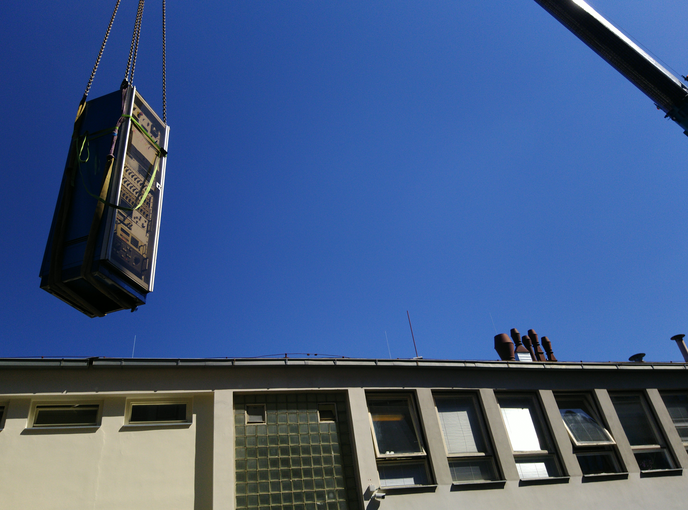
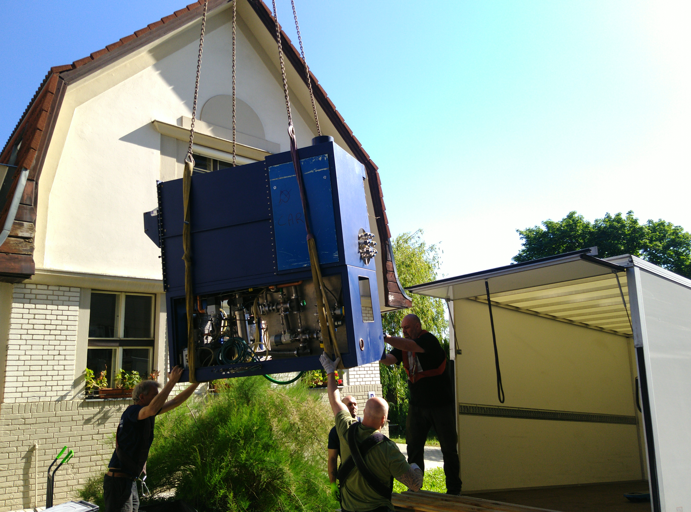

```{r setup, include=FALSE}
library(stringr)
library(ggplot2)
library(rmarkdown)
library(knitr)

#cover-img: ../img/E0_with_bubblers.jpeg

```


```{r fig-options, include=FALSE}
base_dir <- "~/photin/krzyklo.github.io/" # i.e. where the jekyll blog is on the hard drive.
base_url <- "/" # keep as is

# If the document is currently being knit, do this; skip it in normal execution
if (!is.null(knitr::current_input())){
  
  # Output path for figures
  fig_path <- paste0("_site/assets/img/", str_remove(knitr::current_input(), ".Rmd"), "/")
  
  # Set base directories
  knitr::opts_knit$set(base.dir = base_dir, base.url = base_url)
  
  # Set figure directories
  knitr::opts_chunk$set(fig.path = fig_path,
                      cache.path = '../cache/',
                      message=FALSE, warning=FALSE,
                      cache = FALSE)
}

```

In late 2021 Photin get in touch with FZU MOVPE group.
It was miracle, to find in nearby country Aix-200 MOVPE system fully equipped to conduct research on III-Sb materials, with scientists, who are experts in this area.  
FZU MOVPE were leaving the field of III-V, and moving to III-N research.  

Visited 4x times Prague in period of 7 months to complete the most important Photin project:

- Nov 2021 - check reactor condition, status, and site review,  

- Jan 2022 - check InGaAsSb R&D progress, discuss reactor modifications for InGaAsSb,  

- May 2022 - get training on reactor use + software operation, supervise dis-assembly, prepare reactor for transport,  

- Jun 2022 - review of InGaAsSb project, reactor loading and transport.  


```{r fig1, include=TRUE, echo=F, warning=F, message=F, out.width="50%"}
# All defaults

include_graphics("../assets/img/220520_FZU_transfer/back.jpg")
```

A lot of cables and pipes to be marked and disconnected.. and work on putting together other Photin reactors, shown that it is not easy to get all things operational again.  

<iframe width="560" height="315" src="https://youtube.com/embed/4R3xLsiTgg0" frameborder="0" allow="autoplay; encrypted-media" allowfullscreen></iframe>

Finally in June 2022, the reactor and associated equipment were removed from 1st floor FZU location, prepared for transport, and loaded onto trucks - the movie shows parts of this process.  

The most precious and delicate parts - cabinet with quartz reactor, 2x PC with HDDs, LayTec RAS equipment were transported by dedicated truck rented and driven by Photin team.   
This is start-up thrill, one day you study literature, write reports for customers, and the next day, you drive truck to cover thousands of kilometers, and collect equipment abroad ;-).  
The rest of equipment, were send with DHL, it took a few weeks to arrive, and unfortunately get some damage in the process.. 

```{r fig2, include=TRUE, echo=F, warning=F, message=F}
# All defaults


```

After arrival, first things first, we have made backups of all HDDs, connected RAS, and verified RAS and Control PC all working fine..   
<BR>
We told ourselves, this is our last reactor we collected, now we have enough hardware, to work for next 20 years on-site...  

```{r fig3, include=TRUE, echo=F, warning=F, message=F}
# All defaults


include_graphics("../assets/img/220520_FZU_transfer/")
include_graphics("../assets/img/220520_FZU_transfer/packed4dhl.jpg")
```

