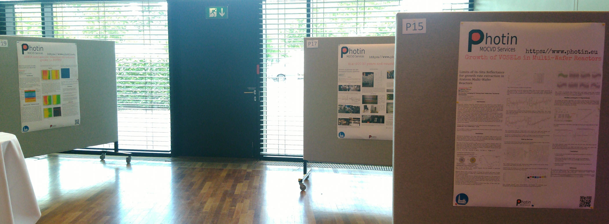

```{r setup, include=FALSE}
library(stringr)
library(ggplot2)
library(rmarkdown)
library(knitr)

#cover-img: ../img/

```

```{r fig-options, include=FALSE}
base_dir <- "~/photin/krzyklo.github.io/" # i.e. where the jekyll blog is on the hard drive.
base_url <- "/" # keep as is

# If the document is currently being knit, do this; skip it in normal execution
if (!is.null(knitr::current_input())){
  
  # Output path for figures
  fig_path <- paste0("_site/assets/img/22_07_11_icmovpe/", str_remove(knitr::current_input(), ".Rmd"), "/")
  
  # Set base directories
  knitr::opts_knit$set(base.dir = base_dir, base.url = base_url)
  
  # Set figure directories
  knitr::opts_chunk$set(fig.path = fig_path,
                      cache.path = '../cache/',
                      message=FALSE, warning=FALSE,
                      cache = FALSE)
}

```


It is tremendous pleasure to go again to international conference. Last time it was 11 years ago at EW-MOVPE XIV in Wroclaw. Apparently, when working in industry conferences are rare treat.  

This time aim is to see what are the hot topics in MOCVD community, what are interesting fields of research, what people work on in labs, and understand better the MOCVD semiconductor landscape to position such small start-up as Photin.  

Photin would present some work done in recent 2 years with excellent teams:  

- with ams-OSRAM about in-situ monitoring of VCSELs growth  

- with FZU(Czech Academy of Sciences) growth of eSWIR antimonide detectors in MOCVD  

- and last but not least some info about the wonderful Aix-200 reactor platform, which are used to grow compound semiconductor wafers.    


```{r fig1, include=TRUE, echo=F, warning=F, message=F}
# All defaults

```
Fig. 1 Photin corner with posters.

Being on such conference is pure thrill and FLOW! So many scientist work on so many topics, and it is so difficult to assimilate what they present, speak with them to learn more, and get better understanding!!  


# Aftermath - 6 months later

Some thoughts after conference:  

- prof. Ferdinand Scholz - one of Photin's reactors come from prof. Scholz, it was very nice to meet him again. 

- prof. Stuart Irvine - last time w have meet, when I was working on MCT for VIGO-Photonics, in EWMOVPE 2009 in Ulm, and there were a few MOCVD labs working on MCT worldwide. Now It is only Selex-Galileo and VIGO-Photonics. I was probably the only one from audience, who appreciated and deeply understood, how important practical implications his research brought. Yes, in VIGO we experimentally searched out and set optimal II/VI ratio for doping (from lifetime of IR detectors), and it was close to what prof. Irvine found. Though not exactly, and prof. Irvine shown scientific way, how this process should be done. Excellent work, that was shared with my collegues from VIGO, who still work actively on this technology.

- Jean Decobert - his research on InPoSi was one of the most interesting lectures. Additionally, he is user of Aix-200/4, and he shared very interesting feedback on detecting susceptor rotation when using LayTec in-situ monitoring in 3x2" configuration!  

- Sergej Vollmer - it was fantastic to discuss GaAs-based research, that Stuttgart University currently run, and discuss his view on compound semiconductor market.  

- VIGO-Photonics - Wlodek Strupinski, Iwona Pasternak, Walery Kołkowski - they work on VCSELs, but also worked on Extended InGaAs detectors, the incumbent eSWIR technology, which is to be replaced by our InGaAsSb/AlGaAsSb barrier detectors.  

- Wroclaw University of Technology -  Mikolaj Badura, Damian Radziewicz, Beata Sciana - I didn't know they purchased new CCS and work on InP technology development!  

- Aixtron Team - really enjoyed discussing with Ilio Miccoli he has impressive experience in running G3 and G4 planetary reactors on InP materials.  

- Dietmar A. Schmitz - Vice President Corporate Technology Transfer - he is the person who installed all Photin 4 MOCVD reactors in their first labs!!! It was fantastic to be able to meet him, and get his encouragement and warm words to continue to work on Photin's reactors.  

- Oliver Meyer - University of Marburg works on decomposition temperature of TBA and TBP, I was very curious about this topic before, as AsH3/PH3 pyrolysis temperature could cause melting of gratings during heat-up  for DFB infill-regrowth.  

- Richard Brown - Cardiff University - he is working on Ga-free type 2 SLs in MOCVD!! This is topic, that Photin would like to explore as well!  

- Agnieszka Paszuk -  Ilmenau University of Technology, it was fantastic to learn that she use RAS to highlight complex effects during growth of GaP on Si and nucleation on Ge substrates. I learned from her a lot about RAS, which is waiting to be used on reactor acquired from FZU MOVPE lab.  

- Jean Pascal Duchemin - grandfather of MOVPE/MOCVD, his lecture was just outstanding, seeing how many adversities he was facing, and how much he didn't know, but was able to overcome due to consistent attempts, change something, and run next experiment, *you do not know what is going on, why, what to do?!*, **change something** *and run next experiment*. That is being epitaxy engineer..  

I had also "a hah!, Eureka!" moments on the conference, where one of unsolved riddles from growth of lasers on InP, get addressed in completely different scenario, and suddenly "clicked". It is pity, that this new insight, cannot be applied yet, to get better InP lasers..  

Without doubt ICMOVPE provide a lot of "food for thoughts", and opportunity to meet many excellent researchers working on edge research.  

Though, it was not place to meet potential customers.  
No direct capitalization on outcomes from conference yet.  

In a few days will publish posters.


