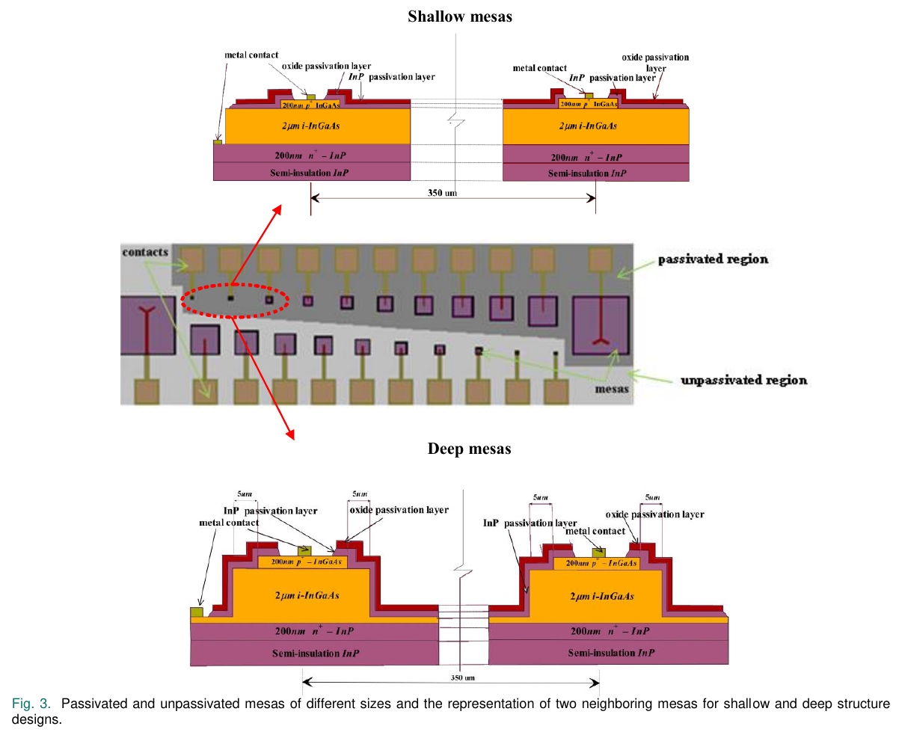
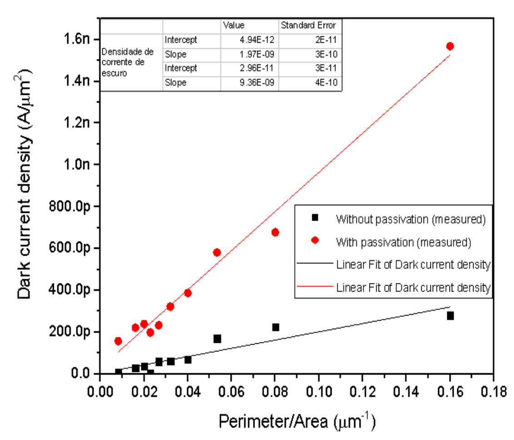
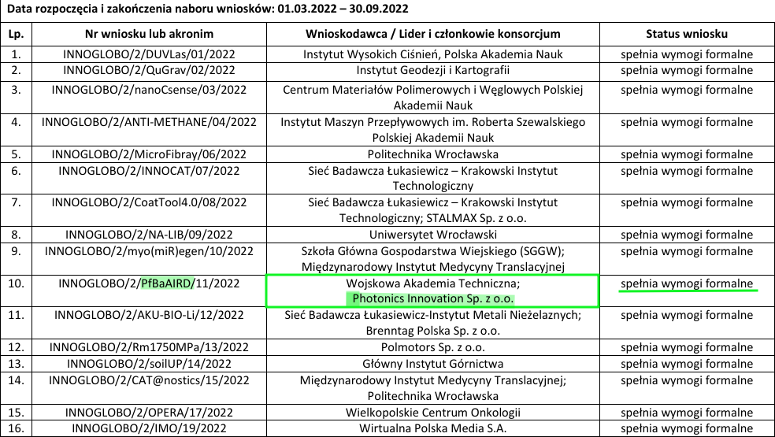

```{r setup, include=FALSE}
library(stringr)
library(ggplot2)
library(rmarkdown)
library(knitr)

#cover-img: ../img/E0_with_bubblers.jpeg


```


```{r fig-options, include=FALSE}
base_dir <- "~/photin/krzyklo.github.io/" # i.e. where the jekyll blog is on the hard drive.
base_url <- "/" # keep as is

# If the document is currently being knit, do this; skip it in normal execution
if (!is.null(knitr::current_input())){
  
  # Output path for figures
  fig_path <- paste0("_site/assets/img/221224_MVP/", str_remove(knitr::current_input(), ".Rmd"), "/")
  
  # Set base directories
  knitr::opts_knit$set(base.dir = base_dir, base.url = base_url)
  
  # Set figure directories
  knitr::opts_chunk$set(fig.path = fig_path,
                      cache.path = '../cache/',
                      message=FALSE, warning=FALSE,
                      cache = FALSE)
}

```

### Intro
[RFQ](mailto:kk@photin.eu?subject=Testing out mailto!&body=This is only a test!){: .btn .btn-blue} email me.  

<button type="button" class="btn btn-primary" href="mailto:kk@photin.eu?subject=Testing out mailto!&body=This is only a test!"><span class="cil-contrast btn-icon mr-2"></span> Primary</button>


<a class="btn btn-success" href="mailto:info@photin.eu?subject=[RFQ]InGaAsP structure&body=Dear Photin,\n We would like to ...">RFQ</a>  


```{r test, echo=FALSE, out.width="50%"}
tab <- tibble::tibble(" " = '<a href="mailto:info@photin.eu?subject=[RFQ]InGaAsP structure&body=Dear Photin,\n We would like to ..."></a>', 
                      Team = "Boston Celtics", Wins = 82,
                      "Link"='<a class="btn btn-success" href="mailto:info@photin.eu?subject=[RFQ]InGaAsP structure&body=Dear Photin,\n We would like to ...">RFQ</a>')

knitr::kable(tab, format = "html", escape = FALSE)

```

[Click me](mailto:kk@photin.eu){: .btn}
One of the best paths for survival of deep-techs, is non-dilutive financing via EU and national grants.  
Photin is exploring this path for ~1 year.  Recently, we had deepened our cooperation with [Military University of Technology](https://www.wtc.wat.edu.pl/) and [K.I.N.D. Lab](https://ece.osu.edu/krishna-infrared-detector-k.i.n.d.-laboratory), which manifested in application for [InnoGlobo 2](https://www.gov.pl/web/ncbr/ii-konkurs-w-ramach-programu-innoglobo) in 2022.  
The project is focused on low temperature IR detector passivation using MOCVD technology.  

### Passivation challenges

Despite perfect passivation results shown usually in publication, the true processing results are not so ideal, and there are process variations.  
Even for apparently mature InP/InGaAs detectors technology, passivation of small pixels is challenging (https://doi.org/10.1109/JSEN.2020.2987006).

```{r fig00, include=TRUE, echo=F, warning=F, message=F}
# All defaults

#include_graphics("../assets/img/221224_MVP/2625_JV_planarny_300mikr.pdf")
#include_graphics("../assets/img/221224_MVP/2625_Ri_planarny_300 um.pdf")
```

Passivation of antimonides is even more challenging than InGaAs/InP.   

```{r fig000, include=TRUE, echo=F, warning=F, message=F}
# All defaults

#include_graphics("../assets/img/221224_MVP/2625_JV_planarny_300mikr.pdf")
#include_graphics("../assets/img/221224_MVP/2625_Ri_planarny_300 um.pdf")
```

### List of InnoGlobo2 applications

```{r fig0, include=TRUE, echo=F, warning=F, message=F}
# All defaults

#include_graphics("../assets/img/221224_MVP/2625_JV_planarny_300mikr.pdf")
#include_graphics("../assets/img/221224_MVP/2625_Ri_planarny_300 um.pdf")
```

We proudly announce, that our "PfBaAIRD" project passed formal criteria and is one of 16 projects selected for next stage review.  

Assuming all applicants aimed for maximum ~1.5M, then ~7 of 16 consortiums will receive grant. `r round(10/1.5/16*100,0)`% is one of the highest chances one could have in grant applications.  
We keep our thumbs!  

```{r fig1, include=TRUE, echo=F, warning=F, message=F}
# All defaults

```

