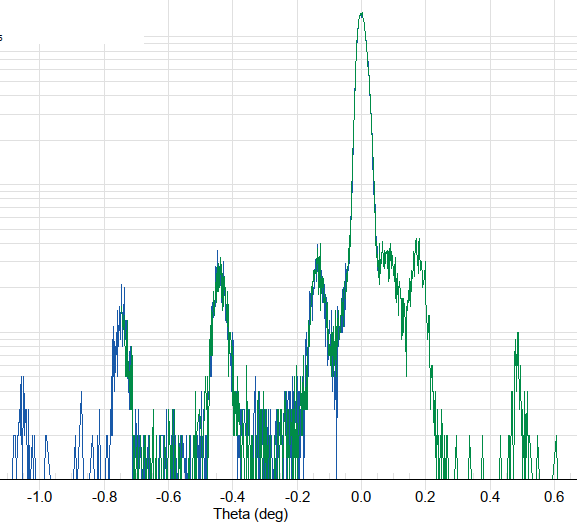
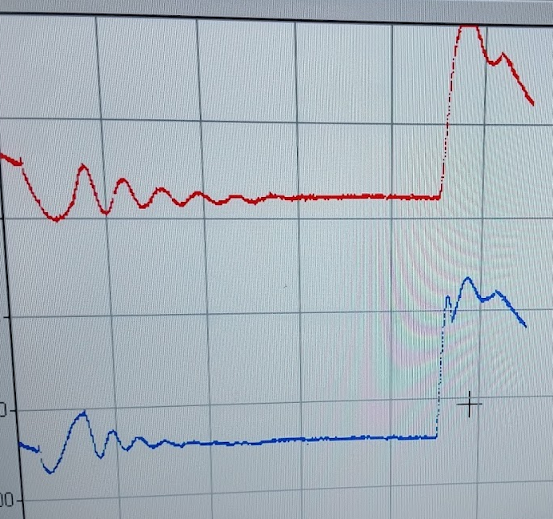
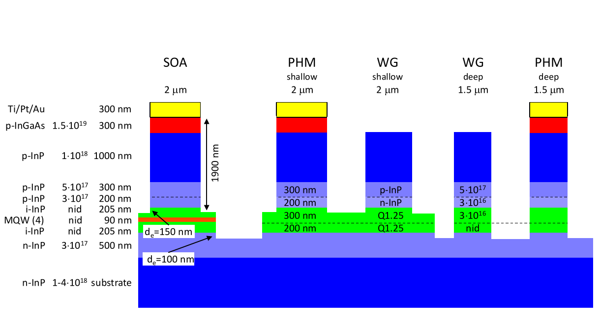

```{r setup, include=FALSE}
library(stringr)
library(ggplot2)
library(rmarkdown)
library(knitr)
library(readr)

#cover-img: ../img/E0_with_bubblers.jpeg
```

```{r fig-options, include=FALSE}
base_dir <- "~/photin/krzyklo.github.io/" # i.e. where the jekyll blog is on the hard drive.
base_url <- "/" # keep as is

# If the document is currently being knit, do this; skip it in normal execution
if (!is.null(knitr::current_input())){
  
  # Output path for figures
  fig_path <- paste0("_site/assets/img/250208_InAs_photodiodes/", str_remove(knitr::current_input(), ".Rmd"), "/")
  
  # Set base directories
  knitr::opts_knit$set(base.dir = base_dir, base.url = base_url)
  
  # Set figure directories
  knitr::opts_chunk$set(fig.path = fig_path,
                      cache.path = '../cache/',
                      message=FALSE, warning=FALSE,
                      cache = FALSE)
}

```

After spectacular success of our InAs-InAsSbP state of the art heterostructures and MWIR detectors made from our wafers, inquiry from Asian University prompted us work on InGaAsP/InGaAs/InP MQW laser.  The aim was to demonstrate InP PICs R&D capability to market.  
We entered into Quantum era, but not the buzzworld quantum, but proper.. Multiple Quantum Wells (MQW) ;-). On the picture below, you could see the first MQW laser structure measured in Photin lab (**on our own wonderful Philips HR XRD!!**).  
```{r mqw, out.width="99%", fig.cap='HR XRD of laser MQW structure', fig.show='hold', echo=F, message = F, warning=F}

```
This is how true quantum looks like ;).  
Constant stream of InP inquires, tempted us to switch materials for a while.  
Long term it turned out to be excellent decision.  
InP platform give much more insight and control.. excellent ECV for background doping confirmation, specular surfaces, lattice matched ternary InGaAs.
On such platform, any equipment problem is immediately obvious.  
It was great joy to go back to materials we have so much commercial experience, and are so familiar with epi-designs:  
- We helped customer to modify his initial layer stack for the best possible performance.  
- Spending years before growing InGaAsP, makes development so much easier (but still InGaAsP is very difficult material, with extreme sensitivity to temperature uniformity).  
- To speed up development, we have employed in-situ monitoring and in-situ etching, so we could in one run test multiple process parameters, on single piece of substrate.  
- The structure was true PICs, as it was split to two growths on 1 wafer: 1st SCH+MQW, and then p-type cladding/contact layers in 2nd run.  

```{r rgr, out.width="99%", fig.cap='In-situ reflectance monitoring of Regrowth and P-type cladding/contact with 2 wavelengths', fig.show='hold', echo=F, message = F, warning=F}

```

BTW. Exchanging Sb into Ga (InSbAsP -> InGaAsP) makes terrific difference. Sb-compounds are way more challenging.    

Later in 2026, we aim to demonstrate, growth of all building blocks for PICs similar to SMART Photonics below.  
```{r jeppix, out.width="99%", fig.cap='InP PICs building blocks Jeppix/SMART', fig.show='hold', echo=F, message = F, warning=F}

```

We call to photonics engineers and designers, who would like to test our wafers.  
