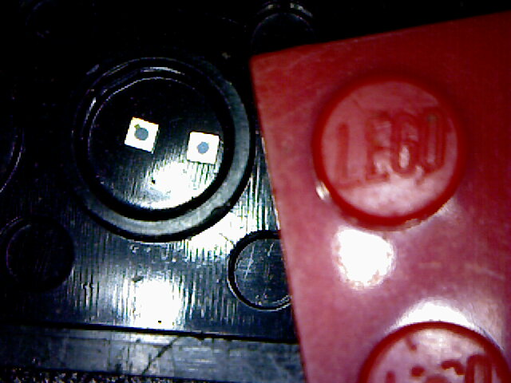
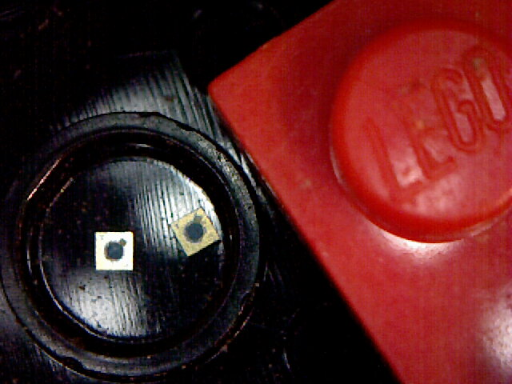
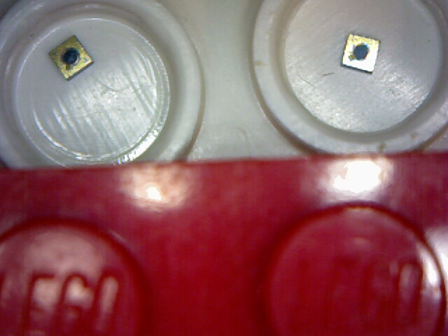

```{r setup, include=FALSE}
library(stringr)
library(ggplot2)
library(rmarkdown)
library(knitr)
library(readr)

#cover-img: ../img/E0_with_bubblers.jpeg
```

```{r fig-options, include=FALSE}
base_dir <- "~/photin/krzyklo.github.io/" # i.e. where the jekyll blog is on the hard drive.
base_url <- "/" # keep as is

# If the document is currently being knit, do this; skip it in normal execution
if (!is.null(knitr::current_input())){
  
  # Output path for figures
  fig_path <- paste0("_site/assets/img/260327_MWIR-Inas-Samples/", str_remove(knitr::current_input(), ".Rmd"), "/")
  
  # Set base directories
  knitr::opts_knit$set(base.dir = base_dir, base.url = base_url)
  
  # Set figure directories
  knitr::opts_chunk$set(fig.path = fig_path,
                      cache.path = '../cache/',
                      message=FALSE, warning=FALSE,
                      cache = FALSE)
}

```

We were looking for easy way to protect our samples of MWIR InAs detectors chips for shipment to customer, so they would be well protected, couldn't be mixed up, take least amount of space, and be inexpensive.  
During brainstorming, we "stepped on something", which turned out to be perfect package for small batch of semiconductor chips.  
Lets build something together in infrared.  

**#Made in Poland, #Made in EU**

```{r bwlego1, out.width="99%", fig.cap='MWIR detector chips in small LEGO enclosure', fig.show='hold', echo=F, message = F, warning=F}

```


```{r bwlego2, out.width="99%", fig.cap='MWIR detector chips in small LEGO enclosure', fig.show='hold', echo=F, message = F, warning=F}

```
```{r plego, out.width="99%", fig.cap='MWIR detector chips in small LEGO enclosure', fig.show='hold', echo=F, message = F, warning=F}

```
