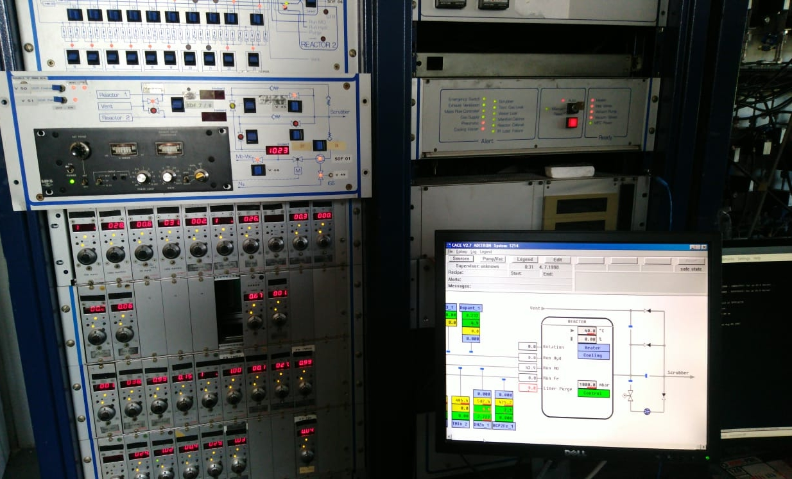
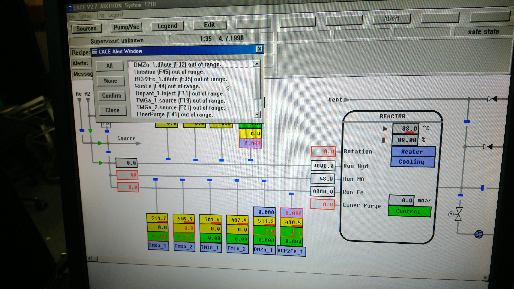

```{r setup, include=FALSE}
library(stringr)
library(ggplot2)
library(rmarkdown)
library(knitr)
library(kableExtra)

#cover-img: ../img/E0_with_bubblers.jpeg

```

Aixtron Aix-200/4 reactor with quartz halogen heating, suitable for growth of 3x 2" and 1x 3".   Acquired in US, and brough to Poland with G1 Planetary reactor together.  


 

```{r fig-options, include=FALSE}
base_dir <- "~/photin/krzyklo.github.io/" # i.e. where the jekyll blog is on the hard drive.
base_url <- "/" # keep as is

# If the document is currently being knit, do this; skip it in normal execution
if (!is.null(knitr::current_input())){
  
  # Output path for figures
  fig_path <- paste0("_site/assets/img/E0/", str_remove(knitr::current_input(), ".Rmd"), "/")
  
  # Set base directories
  knitr::opts_knit$set(base.dir = base_dir, base.url = base_url)
  
  # Set figure directories
  knitr::opts_chunk$set(fig.path = fig_path,
                      cache.path = '../cache/',
                      message=FALSE, warning=FALSE,
                      cache = FALSE)
}

```


All Photin reactors are based on VME technology known for ruggedness and reliability.

**This reactor is planned to bring on-line in Q4 2022, and enable Photin to provide 3" wafer growth.**
  
  
**Inquiries for growth of 2” wafers on GaSb, GaAs, and InP could be sent to kk{sign}photin.eu.**
  
  
```{r fig1, include=TRUE, echo=F, warning=F, message=F}
# All defaults

```


```{r fig2, include=TRUE, echo=F, warning=F, message=F}
# All defaults
include_graphics("assets/img/R2/SCS.jpg")
```


```{r fig3, include=TRUE, echo=F, warning=F, message=F}
# All defaults

```

