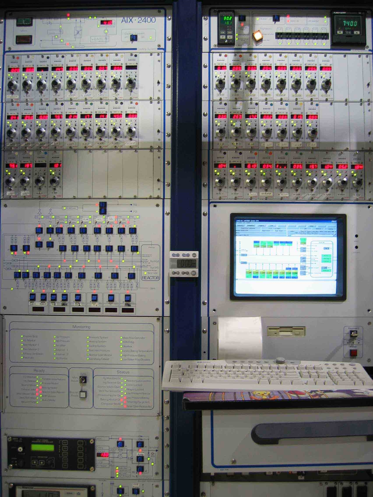

```{r setup, include=FALSE}
library(stringr)
library(ggplot2)
library(rmarkdown)
library(knitr)
library(kableExtra)

#cover-img: ../img/E0_with_bubblers.jpeg

```


MOCVD Planetary Reactor G1
15" x 2" and 8" x 3"  

This reactor was built for US company "Bandgap", and then used by SST, who was put it on CAE for sale.  


Configuration:  
```{r kable, echo=FALSE}
Line=c(1:8)
MO=c("Ga1","Ga2","In1", "In2","Al1","Al2","Mg","Zn")
Hyd=c("As1", "As2", "Ph1", "Si2H6", "HCl", "Spare","","")

knitr::kable(rbind(Hyd,MO),col.names = Line, "simple")
```

Temperature range: Up to 850°C  
Recently used for AlInGaP LEDs  
Gases used: Arsine, Phosphine, DiSi2H6, HCL  
Windows based operating system: Upgraded from OS9  

```{r fig-options, include=FALSE}
base_dir <- "~/photin/krzyklo.github.io/" # i.e. where the jekyll blog is on the hard drive.
base_url <- "/" # keep as is

# If the document is currently being knit, do this; skip it in normal execution
if (!is.null(knitr::current_input())){
  
  # Output path for figures
  fig_path <- paste0("_site/assets/img/", str_remove(knitr::current_input(), ".Rmd"), "/")
  
  # Set base directories
  knitr::opts_knit$set(base.dir = base_dir, base.url = base_url)
  
  # Set figure directories
  knitr::opts_chunk$set(fig.path = fig_path,
                      cache.path = '../cache/',
                      message=FALSE, warning=FALSE,
                      cache = FALSE)
}

```


```{r fig1, include=TRUE, echo=F, warning=F, message=F}
# All defaults

```


**Inquiries for growth of 2” wafers on GaSb, GaAs, and InP could be sent to kk{sign}photin.eu.**

*!!We send Thanks to dr Chen who was the last Epi expert who worked on this machine!!*

